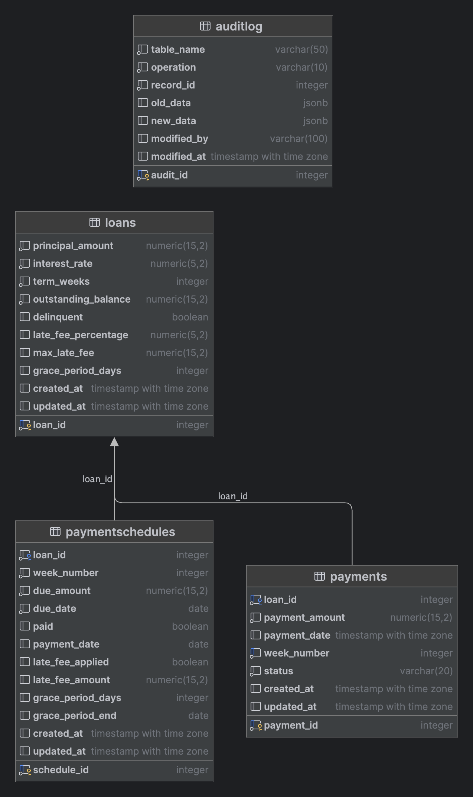

# Billing Engine

Simple code solution for billing engine

## Table of Contents

- [Introduction](#ntroduction)
  - [Features](#features)
- [System Design](#system-design)
  - [Database Design](#database-design)
    - [Scaling PaymentSchedules Table](#scaling-payment-schedule-table)
  - [Late Fee Calculation & Delinquency](#late-fee-calculation-and-delinquency-checker)
    - [Scaling Late Fee & Delinquency](#scaling-late-fee-calculation-and-delinquency-checker-)
  - [Repayment Process](#repayment-process)
    - [Update Delinquency Status](#update-delinquency-status)
    - [Update Delinquency Status with KS](#another-approach-update-delinquency-status)
- [Installation](#installation)
- [Simulate Feature](#simulate-feature-)
  - [Cron Late Fee](#step-to-simulate-cron-late-fee-calculation)
  - [Cron Delinquency](#step-to-simulate-cron-delinquency)
  - [Payment](#step-to-simulate-payment)

## Introduction

This repository contains the design and implementation of Example 1: Billing Engine with simply version

### Core Features

- **Get Outstanding Loan:** This returns the current outstanding on a loan, 0 if no outstanding(or closed),
- **Check Delinquently :** If there are more than 2 weeks of Non payment of the loan amount.
- **MakePayment:** Make a payment 

## System Design

- for simplicity of this code, I will only implement the Billing Engine REST api
- I will put the logic that supposed belong to consumer billing svc as REST api for simplicity

### Database Design

- above is simply version of database design
- for this service I choose using Postgresql
- for simplicity, I not create the borrower table/borrower id

### why not using NoSQL?
- IMO, because this service involve money, so the ACID db is the most suitable, although some other NoSQL db support ACID but I personally prefer PostgresSQL

### Table

- **loans Table** : store the loans of each borrower
- **paymentschedules Table** : store the each installment of loans
- **payments**: store the historical payment attempps from borrower
- **auditlog**: automate data capture change from the table loans, payments, and paymentschedules, using triggers to detect changes

#### Scaling Payment Schedule Table

- There is potential this data will be large due to each loan have 50 week repayment schedule
- can introduce indexing but sometimes not enough
- to optimize the query in the future can introduce database partition for table paymentschedule
- say we want to group the data by each year, so we will make partition by due date

## Late Fee Calculation and Delinquency Checker

for simple usecase we can use this approach to update the late fee and delinquency of lion

### Scaling Late Fee Calculation and Delinquency Checker 

for more real time & scalable, we can use this approach

## Repayment Process


### Update Delinquency Status


### Another Approach Update Delinquency Status


## Technologies

- **Language:** Go
- **Database:** PostgresSQL

## Installation

1. **Clone the repository:**
   ```bash
   git clone https://github.com/arizalsaputro/billing-engine.git 
   ```
2. **Setup Database:**
   - check folder /db
   - setup on your local env or using https://supabase.com/
   - update the database connection in config in /etc/billing-api.yaml

3. **Setup Config**:
   - You can setup the Interest rate, grace period or late fee in `/etc/billing-api.yaml`
   - For simplicity env store in that place
     - ideally for config like this can be store in db
4. **Tidy Up:**
     ```bash 
    go mod tidy 
    ```
5. **Run Local:**
    ```bash 
    go run billing.go -f etc/billing-api.yaml 
    ```
6. **Check Api Docs:** 
    - check swagger.json
    - or import swagger to postman

## Simulate Feature 
- FYI the late fee model used in this code is once late fee, not daily interest late fee
- for simplicity will simulate the design using api, meaning you have to hit API manually
- `/v1/billing/cron` is for simulate cron
- `/v1/billing/consume` is for simulate consumer of message broker

### Step to simulate Cron Late Fee Calculation
1. create loan by api `/v1/billing/create`
2. try get outstanding using `v1/billing/outstanding/{loanId}`
3. manual update/patch column `due date` in table `loan_schema.repaymentschedules`, make behind current date
4. then hit api `/v1/billing/cron/late` 
5. then hit api `/v1/billing/consume/late` to simulate kafka customer 
6. then try hit again `v1/billing/outstanding/{loanId}` to see outstanding change

### Step to simulate Cron Delinquency
1. similar to simulate late fee but make sure to create 2 or more miss payment
2. try hit `/v1/billing/cron/delinquency` to get list loan delinquency
3. hit api `/v1/billing/consume/delinquency` to simulate
4. then try `/v1/billing/delinquency/:loanId` 

### Step to simulate Payment
1. try simulate cron late fist
2. hit `v1/billing/pay/:loanId` to attemps payment
3. hit `v1/billing/consume/pay` to simulate payment behind the scene
4. hit `v1/billing/outstanding/{loanId}` to check outstanding

   
